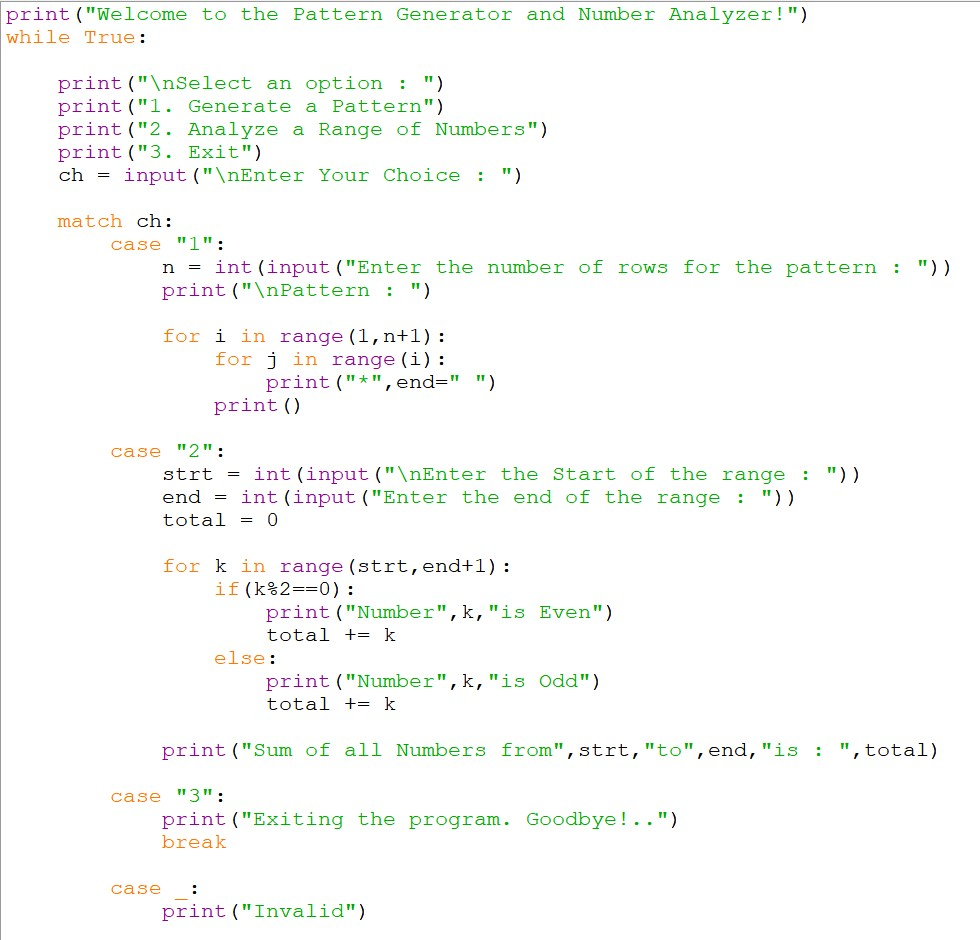
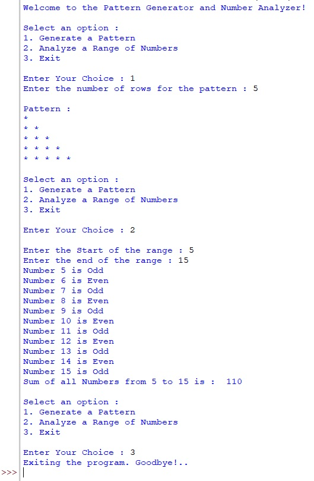

<div align="center">

# 🔢 Logic Box
### Pattern Generator & Number Analyzer

*A menu-driven Python project on loops, control flow & pattern logic*


</div>

---

## 🎯 About

**Logic Box** combines two mini-tools in one menu-driven console app — a **Pattern Generator** that draws a right-angled triangle using nested loops, and a **Number Analyzer** that checks a range of numbers for odd/even and calculates their sum. Built to practice `for`/`while` loops, `range()`, nested loops, and Python's `match-case` statement.

---

## ✨ Features

| Feature | Details |
|---|---|
| 🔺 Pattern Generator | Nested loops draw a right-angled star triangle |
| 🔍 Number Analyzer | Classifies each number in a range as Odd / Even |
| ➕ Sum Calculator | Adds up all numbers in the chosen range |
| 🎛️ Menu-Driven | `match-case` handles all three options cleanly |
| 🔁 Runs Until Exit | `while True` loop, ends with `break` |

---

## 🖥️ How It Works

```text
Start → Show Menu → User picks an option
                       ├── 1: Generate pattern (nested loops)
                       ├── 2: Analyze range (odd/even + sum)
                       └── 3: Exit (break)
                     ↺ Repeats until Exit
```

---

## 📸 Preview

### 🧾 Code

<div align="center">

</div>

### ▶️ Output

<div align="center">


</div>
<br><br>

### 🎥 Video Explanation
<div align="center"> 

[](#)

</div>

---

## 🧠 Key Concepts

**Nested loops** build the triangle row by row:
```python
for i in range(1, n + 1):
    for j in range(i):
        print("*", end=" ")
    print()
```

**`match-case`** replaces a long if-elif chain for the menu:
```python
match ch:
    case "1":
        # Generate pattern
    case "2":
        # Analyze range
    case "3":
        print("Exiting the program. Goodbye!..")
        break
    case _:
        print("Invalid")
```

**Modulo + running total** power the number analysis:
```python
for k in range(strt, end + 1):
    if k % 2 == 0:
        print("Number", k, "is Even")
    else:
        print("Number", k, "is Odd")
    total += k
```

---

## 🚀 Getting Started

```bash
git clone https://github.com/hiren-rw/Logic-Box.git
cd Logic-Box
python logic_box.py
```
Requires **Python 3.10+** (for `match-case`).

---

## 📁 Structure

```text
Logic-Box/
├── logic_box.py
├── code-screenshot.jpg
├── output-screenshot.png
└── README.md
```

---

## 🎓 What I Practiced

`for` & `while` loops • Nested loops • `range()` • `match-case` • `break` • Modulo operator • Menu-driven design

---

<div align="center">

## 👨‍💻 Author

**Hiren RW**

[](https://github.com/hiren-rw)

⭐ *Keep looping. Keep learning.*

</div>
