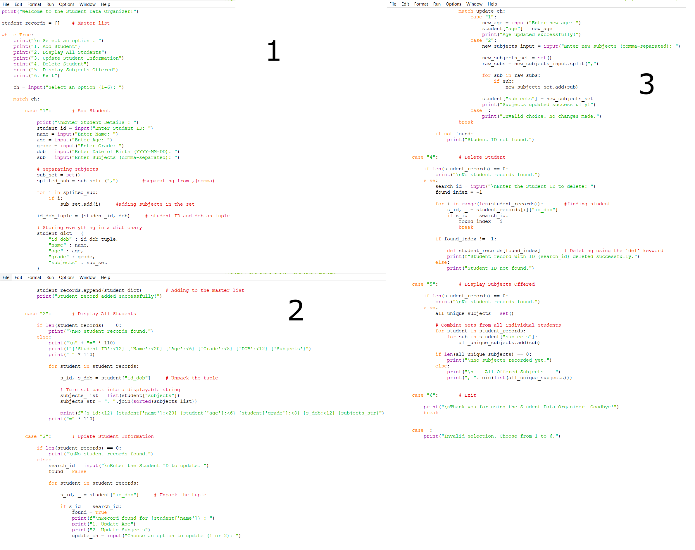
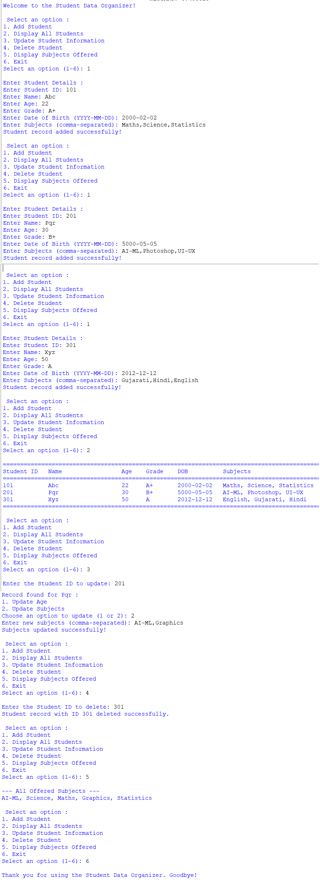

<div align="center">


<br>

[](https://git.io/typing-svg)

<br>


</div>

<br>

## 📑 Table of Contents

<div align="center">

[🎯 Objective](#-objective) • [✨ Features](#-whats-inside) • [🖥️ Flow](#️-how-it-works) • [📸 Preview](#-preview) • [🎬 Demo](#-video-explanation) • [▶️ Run It](#️-run-the-project) • [📁 Structure](#-project-structure) • [👨‍💻 Author](#-author)

</div>

---

## 🎯 OBJECTIVE

> **Build a menu-driven Student Data Organizer that puts Python's core collection types to work.**

This project applies intermediate-level concepts — **string formatting**, **collection data types** (`List`, `Tuple`, `Set`, `Dictionary`), **mutability & immutability**, **type casting**, and the **`del`** keyword — to manage a real (if simple) dataset: student records. 🧑‍🎓

<br>

## ✨ WHAT'S INSIDE?

<div align="center">

| 🧩 Concept | 📌 How It's Used |
|:---:|:---|
| 📋 **List** | Master `student_records` list holding every student |
| 🔒 **Tuple** | Immutable `(student_id, dob)` pair per student |
| 🎯 **Set** | Deduplicated subject collection, per-student and combined |
| 📖 **Dictionary** | Each student stored as `{id_dob, name, age, grade, subjects}` |
| 🔄 **Type Casting** | Converting/validating user input on the fly |
| 🗑️ **`del` Keyword** | Removing a student record from the list |
| 🔤 **String Formatting** | f-strings for clean, aligned table output |
| 🔀 **`match-case`** | Menu routing instead of nested if-elif chains |

</div>

---

## 🖥️ HOW IT WORKS

```text
👋 Welcome Message
   │
   ▼
📜 Show Menu (1-6)
   │
   ├── 1️⃣ Add Student        → collect details, store as dict, append to list
   ├── 2️⃣ Display All        → formatted table of every record
   ├── 3️⃣ Update Student     → find by ID, edit age or subjects
   ├── 4️⃣ Delete Student     → find by ID, remove using del
   ├── 5️⃣ Display Subjects   → union of all subject sets, no duplicates
   └── 6️⃣ Exit               → goodbye message, break loop
   │
   ▼
🔁 Repeats until Exit
```

> 🔐 **Key design choice:** ID + DOB are locked in a **tuple** (they shouldn't change once set), while age and subjects live in a **mutable** dictionary/set so they can be updated freely.

<details>
<summary>🧾 <b>Click to see a sample run</b></summary>

<br>

```text
Select an option (1-6): 1
Enter Student ID: 101
Enter Name: Abc
Enter Age: 22
Enter Grade: A+
Enter Date of Birth (YYYY-MM-DD): 2000-02-02
Enter Subjects (comma-separated): Maths,Science,Statistics
Student record added successfully!

Select an option (1-6): 2
==============================================================================================================
Student ID   Name                 Age    Grade    DOB          Subjects
==============================================================================================================
101          Abc                  22     A+       2000-02-02   Maths, Science, Statistics
==============================================================================================================
```

</details>

---

## 📸 PREVIEW

<div align="center">

<table>
<tr>
<td align="center" width="50%">
<b>🧑‍💻 Code</b><br><br>

</td>
<td align="center" width="50%">
<b>🖨️ Output</b><br><br>

</td>
</tr>
</table>

</div>

---

## 🎬 VIDEO EXPLANATION

<div align="center">

[](./PR-3-Collection%20Manipulator.mp4)

*Click the button above to watch the full walkthrough* 🎥

</div>

---

## ▶️ RUN THE PROJECT

```bash
# 1️⃣ Clone the repository
git clone https://github.com/hiren-rw/Python-Projects.git
cd Python-Projects

# 2️⃣ Run the program
python "Project-3.py"
```

Follow the on-screen menu to add, view, update, delete, or list student records. 🎉

---

## 📁 PROJECT STRUCTURE

```text
PR-3-Collection Manipulator/
│
├── 🐍 Project-3.py
├── 🖼️ 3_code_ss.png
├── 🖼️ 3_output_ss.png
├── 🎬 PR-3-Collection Manipulator.mp4
└── 📘 README.md
```

---

## 🎓 LEARNING OUTCOMES

<div align="center">

`Lists` • `Tuples` • `Sets` • `Dictionaries` • `Mutability & Immutability`
`Type Casting` • `del Keyword` • `String Formatting` • `match-case`

</div>

---

## 👨‍💻 AUTHOR

<div align="center">

**Hiren RW**

[](https://github.com/hiren-rw)
[](https://github.com/hiren-rw/Python-Projects)

### 🚀 One small project. Many Python fundamentals.

**Built with 🐍 Python & curiosity.**

⭐ *Keep learning. Keep building.*


</div>
