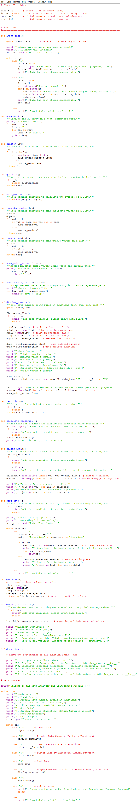
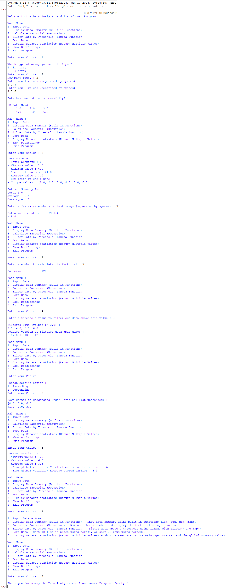

<div align="center">


<br>

[](https://git.io/typing-svg)

<br>


</div>

<br>

## 📑 Table of Contents

<div align="center">

[🎯 Objective](#-objective) • [✨ Features](#-whats-inside) • [🖥️ Flow](#️-how-it-works) • [📸 Preview](#-preview) • [🎬 Demo](#-video-explanation) • [▶️ Run It](#️-run-the-project) • [📁 Structure](#-project-structure) • [👨‍💻 Author](#-author)

</div>

---

## 🎯 OBJECTIVE

> **Build a menu-driven Data Analyzer & Transformer that puts Python's entire function toolkit to work.**

This project — officially titled **"Functional Treat"** — applies intermediate-level concepts: built-in functions, user-defined functions, `*args`, `**kwargs`, recursion, lambda functions, the `global` keyword, and returning multiple values, to analyze and transform 1D and 2D numeric datasets. 🧮

<br>

## ✨ WHAT'S INSIDE?

<div align="center">

| 🧩 Concept | 📌 How It's Used |
|:---:|:---|
| 🧰 **Built-in Functions** | `len()`, `sum()`, `min()`, `max()` power the data summary |
| 🛠️ **User-Defined Functions** | `calc_average()`, `find_duplicates()`, `find_unique()` & more |
| 📦 `*args` | `show_extra_values(*args)` — accepts & displays any number of extra values |
| 🗂️ `**kwargs` | `show_summary_info(**kwargs)` — prints dataset details as key–value pairs |
| 📝 **`__doc__`** | `docstrings()` — pulls and displays every function's docstring live |
| 🔁 **Recursion** | `factorial(n)` — calculates factorial by calling itself |
| λ **Lambda Functions** | `filter()` + `map()` — filters values above a threshold, then doubles them |
| 🌐 **`global` Keyword** | `total` & `avg` tracked globally and reused across functions |
| 🎁 **Multiple Return Values** | `get_stats()` returns `(min, max, average)` — unpacked in one line |
| 📊 **1D & 2D Arrays** | Handles flat lists *and* nested lists, with a neat grid display |
| 🔀 **`sort()` vs `sorted()`** | In-place sort for 1D data, non-mutating `sorted()` for 2D rows |
| 🔀 **`match-case`** | Clean 8-option menu routing instead of nested if-elif chains |

</div>

---

## 🖥️ HOW IT WORKS

```text
👋 Welcome Message
   │
   ▼
📜 Show Menu (1-8)
   │
   ├── 1️⃣ Input Data              → choose 1D / 2D, type-cast & store as list
   ├── 2️⃣ Display Data Summary    → len, sum, min, max + duplicates/uniques + **kwargs + *args
   ├── 3️⃣ Calculate Factorial     → recursive factorial(n)
   ├── 4️⃣ Filter Data (Lambda)    → filter() + map() with a lambda threshold
   ├── 5️⃣ Sort Data               → sort() in-place (1D) / sorted() new list (2D)
   ├── 6️⃣ Display Statistics      → get_stats() returns multiple values, unpacked
   ├── 7️⃣ Show DocStrings         → prints __doc__ for every core function
   └── 8️⃣ Exit                    → goodbye message, break loop
   │
   ▼
🔁 Repeats until Exit
```

> 🔐 **Key design choice:** dataset totals (`total`, `avg`) are tracked in **global** variables so any function can reuse them, while each analysis task (average, duplicates, factorial, filtering) is broken into its own **pure, reusable function**.

<details>
<summary>🧾 <b>Click to see a sample run</b></summary>

<br>

```text
Enter Your Choice : 1

Which type of array you want to Input?
1. 1D Array
2. 2D Array
Enter Your Choice : 2
How many rows? : 2
Enter row 1 values (separated by spaces) :
1 2 3
Enter row 2 values (separated by spaces) :
4 5 6

Data has been stored successfully!

2D Data Grid :
     1.0     2.0     3.0
     4.0     5.0     6.0

Enter Your Choice : 2

Data Summary :
- Total elements : 6
- Minimum value : 1.0
- Maximum value : 6.0
- Sum of all values : 21.0
- Average value : 3.5
- Duplicate values : None
- Unique values : [1.0, 2.0, 3.0, 4.0, 5.0, 6.0]

Dataset Summary Info :
total : 6
average : 3.5
data_type : 2D

Enter Your Choice : 3

Enter a number to calculate its factorial : 5

Factorial of 5 is : 120
```

</details>

---

## 📸 PREVIEW

<div align="center">

<table>
<tr>
<td align="center" width="50%">
<b>🧑‍💻 Code</b><br><br>

</td>
<td align="center" width="50%">
<b>🖨️ Output</b><br><br>

</td>
</tr>
</table>

</div>

---

## 🎬 VIDEO EXPLANATION

<div align="center">

[](./PR-4-Functional%20Treat.mp4)

*Click the button above to watch the full walkthrough* 🎥

</div>

---

## ▶️ RUN THE PROJECT

```bash
# 1️⃣ Clone the repository
git clone https://github.com/hiren-rw/Python-Projects.git
cd Python-Projects

# 2️⃣ Run the program
python "Project-4.py"
```

Follow the on-screen menu to input data, summarize it, calculate factorials, filter, sort, or view statistics. 🎉

---

## 📁 PROJECT STRUCTURE

```text
PR-4-Functional Treat/
│
├── 🐍 Project-4.py
├── 🖼️ 4_code_ss.png
├── 🖼️ 4_output_ss.png
├── 🎬 PR-4-Functional Treat.mp4
└── 📘 PR-4-README.md
```

---

## 🎓 LEARNING OUTCOMES

<div align="center">

`Built-in Functions` • `User-Defined Functions` • `*args` • `**kwargs` • `__doc__`
`Recursion` • `Lambda Functions` • `global Keyword` • `Multiple Return Values` • `sort() vs sorted()` • `match-case`

</div>

---

## 👨‍💻 AUTHOR

<div align="center">

**Hiren RW**

[](https://github.com/hiren-rw)
[](https://github.com/hiren-rw/Python-Projects)

### 🚀 One small project. Many Python fundamentals.

**Built with 🐍 Python & curiosity.**

⭐ *Keep learning. Keep building.*


</div>
