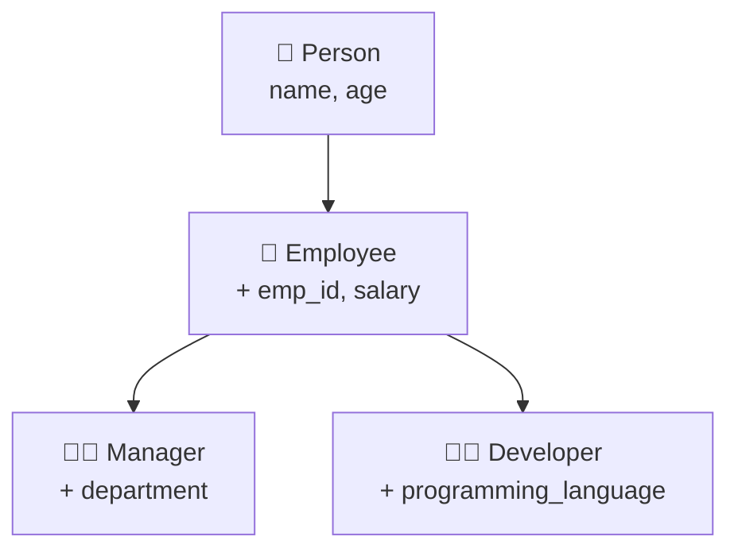
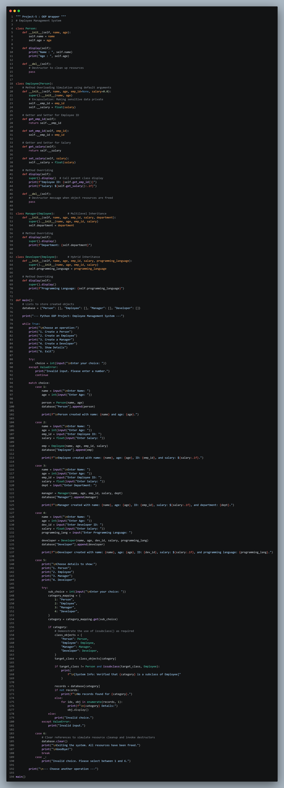


<div align="center">


<br>

[](https://git.io/typing-svg)

<br>


</div>

<br>

## 📑 Table of Contents

<div align="center">

[🎯 Objective](#objective) • [✨ Features](#features) • [🖥️ Flow](#how-it-works) • [📸 Preview](#preview) • [🎬 Demo](#demo) • [▶️ Run It](#run) • [📁 Structure](#structure) • [👨‍💻 Author](#author)

</div>

---

<a id="objective"></a>

## 🎯 OBJECTIVE

> **Build a menu-driven Employee Management System that puts Python's OOP concepts to work.**

This project — titled **"OOP Wrapper"** — uses a class hierarchy of `Person`, `Employee`, `Manager` and `Developer` to create, store and display employee records from a simple console menu. 🧑‍💼

<br>

<a id="features"></a>

## ✨ WHAT'S INSIDE?

<div align="center">

| 🧩 Concept | 📌 How It's Used |
|:---:|:---|
| 🏛️ **Classes & Objects** | `Person`, `Employee`, `Manager`, `Developer` — objects stored in a `database` dictionary |
| 🧬 **Inheritance** | Multilevel: `Person → Employee → Manager / Developer`, with `Manager` and `Developer` both extending `Employee` |
| 🔒 **Encapsulation** | Private `__emp_id` and `__salary`, accessed through getters & setters |
| 🔄 **Method Overriding** | Each subclass extends `display()` to show its own extra details |
| ⬆️ **`super()`** | Calls the parent's constructor and `display()` |
| 🎛️ **Default Arguments** | `emp_id=None, salary=0.0` simulate method overloading |
| 🧹 **Destructor `__del__`** | Defined in `Person` and `Employee`; `database.clear()` on exit releases the objects |
| 🔎 **`issubclass()`** | Verifies a class is a subclass of `Employee` before showing its records |
| 🔀 **`match-case`** | Clean 6-option menu routing |
| 🛡️ **Error Handling** | `try-except` catches invalid menu input |

</div>

---

<a id="how-it-works"></a>

## 🖥️ HOW IT WORKS



```text
👋 Welcome Message
   │
   ▼
📜 Show Menu (1-6)
   │
   ├── 1️⃣ Create a Person     → name, age
   ├── 2️⃣ Create an Employee  → + employee ID, salary
   ├── 3️⃣ Create a Manager    → + department
   ├── 4️⃣ Create a Developer  → + programming language
   ├── 5️⃣ Show Details        → pick a class, display all its records
   └── 6️⃣ Exit                → free all objects, goodbye message
   │
   ▼
🔁 Repeats until Exit
```

> 🔐 **Key design choice:** `emp_id` and `salary` are **private** attributes, so they can only be read or changed through getters and setters.

<details>
<summary>🧾 <b>Click to see a sample run</b></summary>

<br>

```text
Enter your choice: 3

Enter Name: CCC
Enter Age: 33
Enter Employee ID: 333
Enter Salary: 3333
Enter Department: CC

Manager created with name: CCC, age: 33, ID: 333, salary: $3333.0, and department: CC.

Enter your choice: 5

Choose details to show:
1. Person
2. Employee
3. Manager
4. Developer

Enter your choice: 3

[System Info: Verified that Manager is a subclass of Employee]

Manager Details:
Name :  CCC
Age :  33
Employee ID: 333
Salary: $3333.0
Department: CC

Enter your choice: 6

Exiting the system. All resources have been freed.

Goodbye!
```

</details>

---

<a id="preview"></a>

## 📸 PREVIEW

<div align="center">

<table>
<tr>
<td align="center" width="50%">
<b>🧑‍💻 Code</b><br><br>

</td>
<td align="center" width="50%">
<b>🖨️ Output</b><br><br>

</td>
</tr>
</table>

</div>

---

<a id="demo"></a>

## 🎬 VIDEO EXPLANATION

<div align="center">

[](https://github.com/hiren-rw/Python-Projects/releases)

*Click the button above and open the release to watch the full walkthrough* 🎥

</div>

---

<a id="run"></a>

## ▶️ RUN THE PROJECT

Requires **Python 3.10+** (for `match-case`).

```bash
# 1️⃣ Clone the repository
git clone https://github.com/hiren-rw/Python-Projects.git
cd Python-Projects/"PR-5-OOP Wrapper"

# 2️⃣ Run the program
python "Project-5.py"
```

Follow the on-screen menu to create people, employees, managers and developers, then view their details. 🎉

---

<a id="structure"></a>

## 📁 PROJECT STRUCTURE

```text
PR-5-OOP Wrapper/
│
├── 🐍 Project-5.py
├── 🖼️ 5_code_ss.png
├── 🖼️ 5_output_ss.png
└── 📘 README.md
```

> 🎬 The demo video (`PR-5-OOP Wrapper.mp4`) is available in the repository's [Releases](https://github.com/hiren-rw/Python-Projects/releases).

---

## 🎓 LEARNING OUTCOMES

<div align="center">

`Classes & Objects` • `Inheritance` • `Encapsulation` • `Method Overriding` • `super()`
`Default Arguments` • `Destructor` • `issubclass()` • `match-case`

</div>

---

<a id="author"></a>

## 👨‍💻 AUTHOR

<div align="center">

**Hiren RW**

[](https://github.com/hiren-rw)
[](https://github.com/hiren-rw/Python-Projects)

### 🚀 One small project. Many OOP fundamentals.

**Built with 🐍 Python & curiosity.**

⭐ *Keep learning. Keep building.*


</div>
