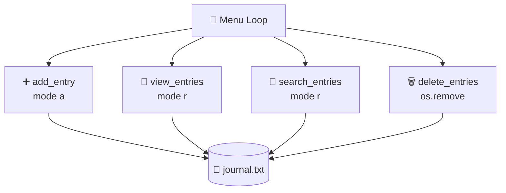
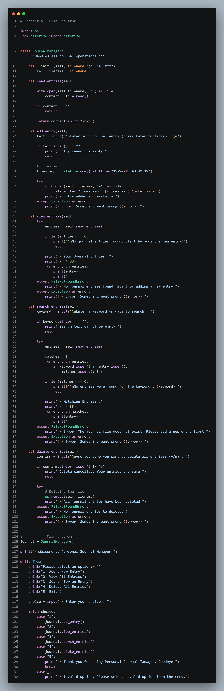
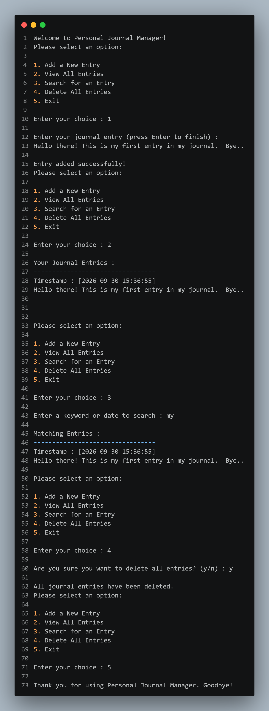

<div align="center"> 

   
</div>

<br>

[](https://git.io/typing-svg)

<br>


</div>

<br>

## 📑 Table of Contents

<div align="center">

[🎯 Objective](#objective) • [✨ Features](#features) • [🖥️ Flow](#how-it-works) • [📸 Preview](#preview) • [🎬 Demo](#demo) • [▶️ Run It](#run) • [📁 Structure](#structure) • [👨‍💻 Author](#author)

</div>

---

<a id="objective"></a>

## 🎯 OBJECTIVE

> **Build a menu-driven journal app that stores your entries in a text file.**

This project — titled **"File Operator"** — uses a `JournalManager` class to add, view, search and delete journal entries saved in `journal.txt`, with errors handled so the program never crashes. 📓

<br>

<a id="features"></a>

## ✨ WHAT'S INSIDE?

<div align="center">

| 🧩 Concept | 📌 How It's Used |
|:---:|:---|
| 🏛️ **Classes & Objects** | `JournalManager` holds every operation as an instance method; one `journal` object runs the program |
| 📂 **File Handling** | `open()` in `"r"` mode reads entries, `"a"` mode appends them (and creates `journal.txt` if missing) |
| 🗑️ **Delete File** | `os.remove()` clears all entries at once, after a `y/n` confirmation |
| 🕒 **Timestamp** | `datetime.now().strftime()` stamps every entry with the date and time |
| 🔎 **Search** | Finds entries by keyword or date, ignoring upper/lower case |
| 🛡️ **Error Handling** | `try-except` catches `FileNotFoundError` and other errors with clear messages |
| ✅ **Input Checks** | Empty entries, empty searches and invalid menu options are rejected politely |
| 🔀 **`match-case`** | Clean 5-option menu routing |

</div>

---

<a id="how-it-works"></a>

## 🖥️ HOW IT WORKS



```text
👋 Welcome Message
   │
   ▼
📜 Show Menu (1-5)
   │
   ├── 1️⃣ Add a New Entry      → type text, saved with a timestamp
   ├── 2️⃣ View All Entries     → show everything in journal.txt
   ├── 3️⃣ Search for an Entry  → keyword or date, show matches
   ├── 4️⃣ Delete All Entries   → confirm (y/n), then delete the file
   └── 5️⃣ Exit                 → goodbye message
   │
   ▼
🔁 Repeats until Exit
```

> 📝 **Key design choice:** each entry is saved as a `Timestamp : [date time]` line followed by your text, with a blank line between entries. Deleting the file removes all entries at once.

<details>
<summary>🧾 <b>Click to see a sample run</b></summary>

<br>

```text
Enter your choice : 1

Enter your journal entry (press Enter to finish) :
Hello there! This is my first entry in my journal.  Bye..

Entry added successfully!

Enter your choice : 3

Enter a keyword or date to search : my

Matching Entries :
---------------------------------
Timestamp : [2026-09-30 15:36:55]
Hello there! This is my first entry in my journal.  Bye..

Enter your choice : 4

Are you sure you want to delete all entries? (y/n) : y

All journal entries have been deleted.

Enter your choice : 5

Thank you for using Personal Journal Manager. Goodbye!
```

</details>

---

<a id="preview"></a>

## 📸 PREVIEW

<div align="center">

<table>
<tr>
<td align="center" width="50%">
<b>🧑‍💻 Code</b><br><br>

</td>
<td align="center" width="50%">
<b>🖨️ Output</b><br><br>

</td>
</tr>
</table>

</div>

---

<a id="demo"></a>

## 🎬 VIDEO EXPLANATION

<div align="center">

[](https://github.com/hiren-rw/Python-Projects/releases)

*Click the button above and open the release to watch the full walkthrough* 🎥

</div>

---

<a id="run"></a>

## ▶️ RUN THE PROJECT

Requires **Python 3.10+** (for `match-case`).

```bash
# 1️⃣ Clone the repository
git clone https://github.com/hiren-rw/Python-Projects.git
cd Python-Projects/"PR-6-File Operator"

# 2️⃣ Run the program
python "Project-6.py"
```

Follow the on-screen menu to add, view, search and delete your journal entries. `journal.txt` is created automatically when you add your first entry. 🎉

---

<a id="structure"></a>

## 📁 PROJECT STRUCTURE

```text
PR-6-File Operator/
│
├── 🐍 Project-6.py
├── 🖼️ 6_code_ss.png
├── 🖼️ 6_output_ss.png
└── 📘 README.md
```

> 🎬 The demo video (`PR-6-File Operator.mp4`) is available in the repository's [Releases](https://github.com/hiren-rw/Python-Projects/releases).

---

## 🎓 LEARNING OUTCOMES

<div align="center">

`File Handling` • `Read & Append Modes` • `os.remove()` • `Exception Handling` • `Classes & Objects`
`datetime` • `match-case`

</div>

---

<a id="author"></a>

## 👨‍💻 AUTHOR

<div align="center">

**Hiren RW**

[](https://github.com/hiren-rw)
[](https://github.com/hiren-rw/Python-Projects)

### 🚀 One small project. Many file handling fundamentals.

**Built with 🐍 Python & curiosity.**

⭐ *Keep learning. Keep building.*


</div>
