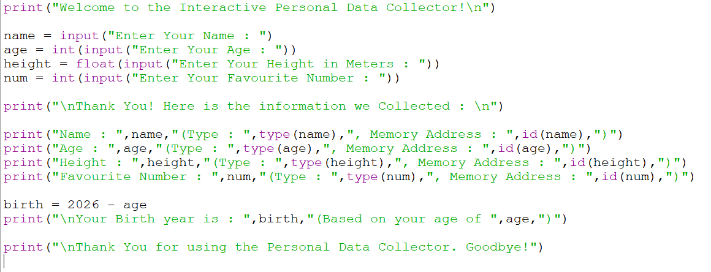

<div align="center">

# 🐍 FUNDAMENTAL BOOSTER

### ⚡ Interactive Personal Data Collector

**A practical Python fundamentals project**

<br>


</div>

---

## 🎯 PROJECT MISSION

> **Learn Python fundamentals by building, not just reading.**

Fundamental Booster is an interactive **Personal Data Collector** created to demonstrate essential Python programming concepts through a simple console-based application.

The program collects personal information, performs basic processing, and displays the value, data type, and object identity of each variable.

---

## ✨ WHAT'S INSIDE?

| 🧩 Feature | 📌 Demonstration |
|---|---|
| 🖨️ Input & Output | `input()` and `print()` |
| 📦 Variables | Storing user information |
| 🔤 Data Types | `str`, `int`, `float` |
| 🔄 Type Casting | `int()` and `float()` |
| ➕ Operators | Birth-year calculation |
| 🔍 Type Checking | `type()` |
| 🧠 Object Identity | `id()` |
| 🧮 Processing | Basic arithmetic & formatted output |

---

## 🖥️ HOW IT WORKS

```text
👋 Start
   │
   ▼
📝 Collect User Information
   │
   ├── 👤 Name
   ├── 🎂 Age
   ├── 📏 Height
   └── 🔢 Favorite Number
   │
   ▼
🔄 Convert Input Types
   │
   ▼
🔍 Display Type + Memory Identity
   │
   ▼
🧮 Calculate Estimated Birth Year
   │
   ▼
✅ Display Final Result
```

---

## 📸 PROJECT PREVIEW

<div align="center">



</div>

---

## 🧠 CORE CONCEPTS

### 🖨️ Input & Output
Uses `input()` to collect information and `print()` to create clear user-friendly output.

### 🔄 Type Casting
Converts text input into the required types:

```python
age = int(input("Enter Your Age : "))
height = float(input("Enter Your Height in Meters : "))
```

### 🧮 Operators

```python
birth = 2026 - age
```

Arithmetic operators are used to process the collected data.

### 🔍 Built-in Functions

```python
type(value)   # Check data type
id(value)     # Check object identity
```

---

## ▶️ RUN THE PROJECT

### 1. Install Python 3.x

### 2. Clone the repository

```bash
git clone https://github.com/hiren-rw/Python-Projects.git
cd Python-Projects
```

### 3. Run the program

```bash
python "Project - 2.1.py"
```

### 4. Enter the requested information and view the result 🎉

---

## 📁 PROJECT STRUCTURE

```text
PR-1-Fundamental Booster/
│
├── 🐍 Project - 2.1.py
├── 🖼️ project-screenshot.png
└── 📘 README.md
```

---

## 🎓 LEARNING OUTCOMES

This project demonstrates practical understanding of:

**Variables** • **Data Types** • **Input/Output** • **Type Casting**  
**Operators** • **Built-in Functions** • **Object Identity** • **Formatted Output**

---

## 👨‍💻 AUTHOR

**Hiren RW**

[](https://github.com/hiren-rw)

---

<div align="center">

### 🚀 One small project. Many Python fundamentals.

**Built with 🐍 Python & curiosity.**

⭐ *Keep learning. Keep building.*

</div>
